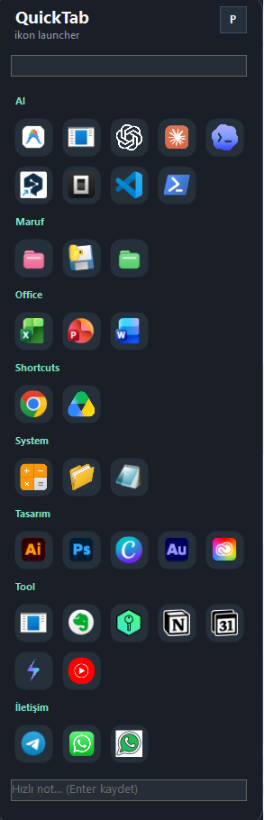
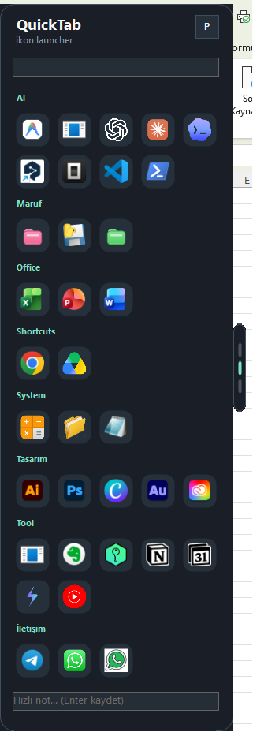
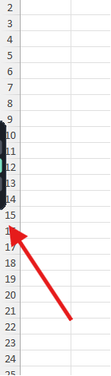

# QuickTabLauncher

QuickTabLauncher is a small Windows edge launcher. It stays as a thin tab on the side of the screen, opens on hover, and gives quick access to apps, websites, folders, shortcuts, and a tiny note inbox.

It is meant for people who jump between the same tools all day and want a lightweight launcher without a full dashboard.

## Screenshots

<p>
  
  
  
</p>

## Features

- Hover tab on the left edge of the screen
- Draggable edge tab with remembered vertical position
- Grouped app and website launcher
- Automatic shortcut discovery from the `Shortcuts` folder
- Nested shortcut folders become launcher groups
- Tray icon with refresh and folder/config actions
- Optional Windows startup registration
- Quick note box that appends timestamped notes to `Notes\Inbox.md`
- Portable publish option for carrying the launcher to another Windows machine

## Use Cases

- Keep daily work apps one hover away
- Group customer, project, or communication shortcuts
- Keep URLs and local apps in one small launcher
- Use `Shortcuts` as a no-code way to add apps
- Capture small notes without opening a larger note app
- Carry a portable launcher setup between Windows machines

## Requirements

- Windows 10 or Windows 11
- .NET 8 Desktop Runtime for the framework-dependent build
- No runtime install needed for the self-contained portable build

## Build

From PowerShell:

```powershell
.\build.ps1
```

This creates the smaller framework-dependent build in `publish`.

For a portable self-contained build:

```powershell
.\build.ps1 -SelfContained
```

This creates `publish-portable`.

## Configuration

Edit `config\apps.json` before building or edit `publish\config\apps.json` after publishing.

Example:

```json
[
  {
    "name": "Notepad",
    "path": "%WINDIR%\\notepad.exe",
    "group": "System"
  },
  {
    "name": "ChatGPT",
    "path": "https://chatgpt.com",
    "group": "Web"
  }
]
```

Supported `path` values:

- `.exe` paths
- commands available on `PATH`
- folder paths
- `https://` URLs
- Windows `shell:AppsFolder\...` app identifiers

Optional fields:

- `group`: group label shown in the launcher
- `arguments`: command-line arguments
- `icon`: custom icon path

### Custom Icons

Put your own `.png`, `.jpg`, `.bmp`, or `.ico` files in an `Icons` folder next to the app, then point an item to that file:

```json
{
  "name": "WhatsApp Web",
  "path": "https://web.whatsapp.com",
  "group": "Communication",
  "icon": "Icons\\whatsapp-web.png"
}
```

For apps discovered from `Shortcuts`, you do not need an `apps.json` entry. Put an icon in `Icons` with the same display name, for example:

```text
Icons
  Google Drive.png
  WhatsApp Web.png
```

Short unique names also work when they match part of the app name, such as `drive.png` for `Google Drive`.

Folder shortcuts get a colored folder icon automatically when no custom icon is found. The color is derived from the folder name, so frequently used folders are easier to tell apart without adding labels.

`Icons` is ignored by git by default, so personal or machine-specific icon artwork stays local unless you intentionally change that.

If an image was downloaded as AVIF or WebP, convert it to a real PNG/JPG first. Renaming the file extension to `.png` is not enough.

## Shortcuts Folder

Place `.lnk`, `.url`, `.exe`, `.bat`, or `.cmd` entries in `Shortcuts`.

Nested folders become groups:

```text
Shortcuts
  Work
    VS Code.lnk
  Communication
    Slack.lnk
```

The app watches the folder and refreshes automatically when shortcuts change. It also watches `Icons`, so new custom icons appear after the next refresh.

## Notes

Type in the quick note box and press Enter. Notes are appended to:

```text
Notes\Inbox.md
```

`Notes` is ignored by git because it is personal runtime data.

## Privacy and Security

This repository intentionally contains only source code and safe sample configuration.

Not included:

- personal shortcuts
- generated `publish` folders
- generated binaries
- local notes
- machine-specific icons
- secrets or tokens

Before sharing your own fork, check `config`, `Shortcuts`, and `Notes` for personal paths or private links.

## License

MIT License. See `LICENSE`.
